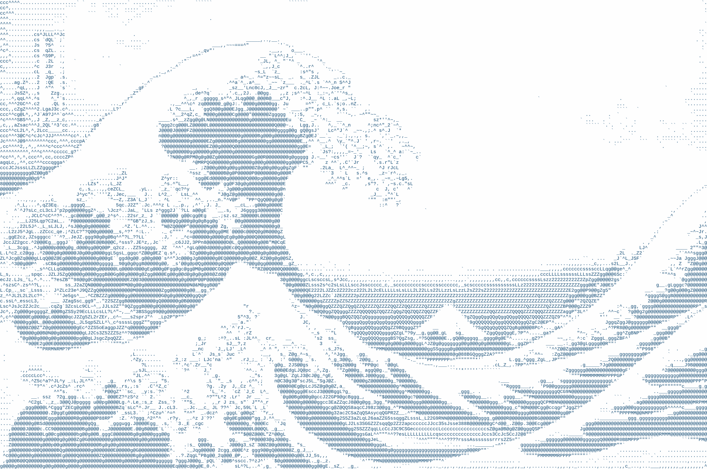

# ASCII Art Generator

A command line program to generate ASCII art from an image

## Example!

Run `cargo run --release -- -i target/Tsunami_by_hokusai_19th_century.jpg -o media/wave.png -w 250 -g 0.8 -c 1.2 -t image -x 0a4570 -s 12`



## Details

The program considers the shape of the characters, not just the intensity. Each character
is split into 9 squares, and the intensity of each section is calculated. Afterwards, weights
for the left, top, bottom, right and middle are calculated according to the following:

```
/// lt t rt
/// l  m  r
/// lb b rt
```
where areas with `l` contribute to the left, areas with `t` contribute to the top, etc.
Finally, each block in the input image is matched to a character to minimise `sum_{i=1}^5 |u_i - v_i|`,
where `u_1, ... u_5` are the weights of the top, bottom, left, right, middle of an area in the picture,
and `u_1, ... v_5` are the corresponding values for a character.

## Usage

```
USAGE:
    asciiart [OPTIONS] --input-filename <input-filename> --output-type <output-type> --output-width <output-width>

FLAGS:
    -h, --help       Prints help information
    -V, --version    Prints version information

OPTIONS:
    -b, --background-colour <background-colour>     [default: fefefe]
    -c, --contrast <contrast>                      Higher values mean greater contrast [default: 1.0]
    -a, --font-aspect <font-aspect>
            The width to height ratio of a single character, used for computations

    -f, --font-filename <font-filename>
            The font is used for computations and display if the output is an image

    -s, --font-size <font-size>                     [default: 12.]
    -g, --gamma <gamma>
            The intensity of a pixel is modified according to the formula intensity^(gamma) where the intensity is
            between 0 and 1 [default: 1.0]
    -i, --input-filename <input-filename>          
    -o, --output-filename <output-filename>        
    -t, --output-type <output-type>                 [possible values: Stdout, Text, Image]
    -w, --output-width <output-width>              The output width in characters
    -x, --text-colour <text-colour>                 [default: 101010]
```

## Notes

* Only one colour each is supported for the foreground and background.
  So the program will only work well on some pictures, and images with lower contrast
  will produce suboptimal results.
* This program may do unexpected things, including but not limited to
  causing your computer to self-destruct, launching nuclear bombs, or
  creating an infestation of crabs in your city.

